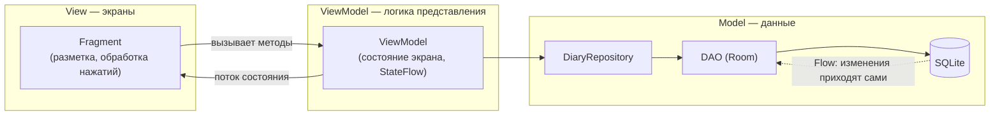
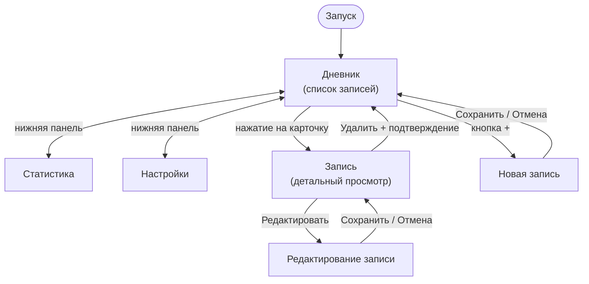

# Архитектура приложения

## 1. Выбранный подход — MVVM

Техническое задание прямо запрещает держать весь код в `Activity`.
В проекте применён паттерн **MVVM** (Model — View — ViewModel).



Ключевое правило: **стрелки идут только в одну сторону**. Фрагмент знает о
ViewModel, ViewModel — о репозитории, репозиторий — о базе. Обратно данные
возвращаются потоками, а не прямыми вызовами. Поэтому база ничего не знает
об экранах, и её можно тестировать и заменять отдельно.

### Зачем это нужно на практике

Поворот экрана уничтожает `Fragment`, но не `ViewModel` — введённый текст и
загруженный список переживают поворот сами, без ручного сохранения в
`onSaveInstanceState`.

## 2. Структура пакетов

```
com.nastya.diary
├── DiaryApplication.kt        — контейнер зависимостей приложения
├── data                       — слой Model
│   ├── model                  — доменные модели: DiaryEntry, Category, Tag, Mood
│   ├── database               — Room: база, преобразователи типов
│   │   ├── entity             — таблицы: CategoryEntity, EntryEntity, TagEntity,
│   │   │                        EntryTagCrossRef
│   │   ├── relation           — EntryWithRelations: запись с категорией и тегами
│   │   └── dao                — запросы: EntryDao, CategoryDao, TagDao
│   ├── preferences            — настройки приложения (DataStore)
│   └── repository             — DiaryRepository, единая точка доступа к данным
├── ui                         — слой View
│   ├── MainActivity.kt        — единственная Activity, хост навигации
│   ├── list                   — экран списка записей
│   ├── detail                 — экран просмотра записи
│   ├── editor                 — экран создания и редактирования
│   ├── stats                  — экран статистики
│   ├── settings               — экран настроек
│   └── adapters               — адаптеры списков RecyclerView
├── viewmodels                 — слой ViewModel
└── utils                      — вспомогательные классы: фабрика ViewModel,
                                 форматирование дат, экспорт в PDF
```

Такое разделение прямо соответствует требованию ТЗ о пакетах
`models`, `database`, `adapters`, `ui`, `utils`, `viewmodels`.

## 3. Навигация

Приложение построено по схеме **single-activity**: одна `MainActivity` и пять
фрагментов внутри неё.



Переходы описаны в `res/navigation/nav_graph.xml`. Три экрана верхнего уровня
связаны с `BottomNavigationView` — идентификаторы пунктов меню совпадают с
идентификаторами экранов графа, поэтому `NavigationUI` связывает их сам.

Экраны записи и редактора открываются поверх списка, и на них нижняя панель
скрывается: она занимала бы место и предлагала уйти с экрана, где есть
несохранённые изменения.

Аргументы между экранами передаются через **Safe Args** — плагин генерирует
типизированные классы, поэтому передать строку туда, где ждут число, попросту
не получится: ошибка всплывёт при компиляции, а не при запуске.

## 4. Работа с потоками

| Что | Где выполняется |
|-----|-----------------|
| Запросы к базе (`suspend`, `Flow`) | `Dispatchers.IO` — фоновый поток |
| Преобразование данных во ViewModel | `viewModelScope` |
| Обновление интерфейса | главный поток, через `repeatOnLifecycle` |

Room не даёт выполнить запрос в главном потоке — он бросит исключение при
попытке. Это защита от «зависшего» интерфейса: приложение, которое читает
базу в главном потоке, подвисает тем заметнее, чем больше в нём данных.

Подписка на потоки во фрагментах оформляется через
`viewLifecycleOwner.lifecycleScope.launch { repeatOnLifecycle(STARTED) { ... } }`:
пока экран не виден, обновления не приходят и не тратят заряд батареи.

## 5. Состояние экрана

Каждый экран описывает своё состояние одним неизменяемым объектом:

```kotlin
data class EntryListUiState(
    val entries: List<DiaryEntry> = emptyList(),
    val isLoading: Boolean = true,
    val errorMessage: String? = null
)
```

Так исключается ситуация, когда на экране одновременно виден и индикатор
загрузки, и заглушка «записей нет», и список: состояние всегда одно и
описано целиком.

## 6. Обработка ошибок

Операции записи в репозитории возвращают `Result<T>`, а не бросают исключения:

```kotlin
suspend fun createEntry(entry: DiaryEntry): Result<Long> = runCatching { ... }
```

ViewModel разбирает результат и кладёт в состояние экрана текст ошибки,
а фрагмент показывает `Snackbar`. Приложение сообщает о проблеме, но не
падает — прямое требование ТЗ.

## 7. Сборка проекта

| Файл | Назначение |
|------|------------|
| `settings.gradle.kts` | Модули проекта и репозитории зависимостей |
| `gradle/libs.versions.toml` | Каталог версий: все версии библиотек в одном месте |
| `build.gradle.kts` | Корневой файл: объявление плагинов |
| `app/build.gradle.kts` | Настройки модуля приложения и список зависимостей |
| `gradlew`, `gradle/wrapper/` | Обёртка Gradle: проект собирается одинаково на любой машине |

Из заметного в настройках модуля:

* `viewBinding = true` — вместо `findViewById`. Опечатка в идентификаторе
  становится ошибкой компиляции, а не падением при запуске.
* `isCoreLibraryDesugaringEnabled = true` — позволяет пользоваться
  `java.time.LocalDate` начиная с Android 7.0, хотя штатно этот класс
  появился только в Android 8.0.
* `room.schemaLocation` — Room выгружает схему базы в JSON, и изменения
  структуры таблиц видны в истории git.
